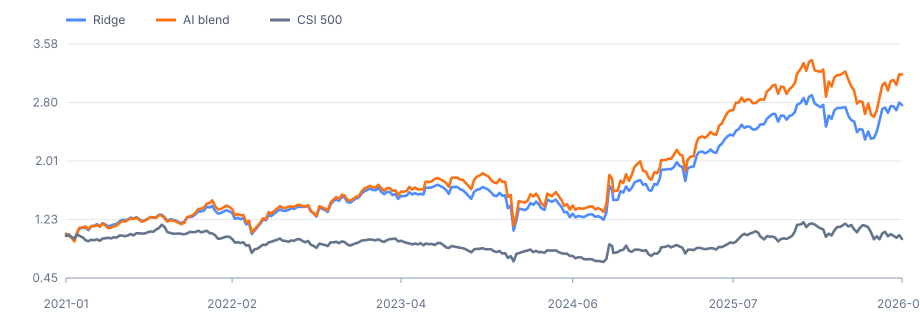
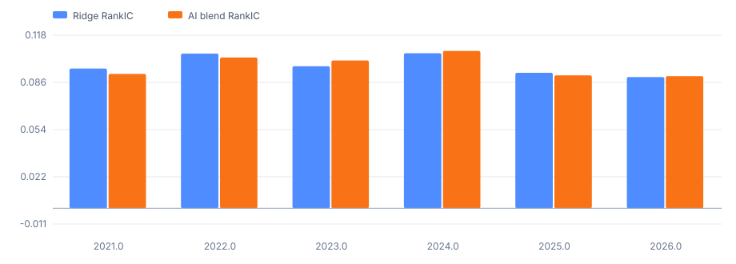
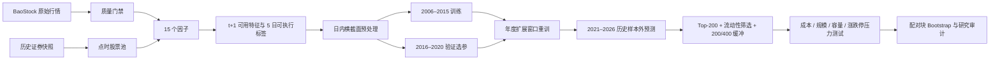

# A 股点时多因子与机器学习研究

这是一个从原始行情、点时股票池到可执行组合和统计审计的完整 A 股量化研究项目。研究对象是周频横截面选股：在每个决策日只使用当时可获得的信息排序股票，下一交易日收盘执行，随后持有 5 个交易日。

项目的目标不是寻找最好看的回测曲线，而是回答三个可检验的问题：传统因子是否在严格时序下仍有预测力、非线性模型是否提供可泛化增量、收益能否经受成本与成交约束。

## 结论先行

| 历史样本外结果（2021–2026，共同 291 周） | Ridge | HGB + Ridge |
|---|---:|---:|
| 20bp 成本后年化收益 | **19.9%** | **22.9%** |
| 最大回撤 | -36.2% | -37.9% |
| 年化收益相对 Ridge 增量 | — | +3.2 pct |
| 增量的 13 周块 bootstrap 95% 区间 | — | **[-0.9%, 7.4%]** |

- Ridge 在 2021–2026 每个自然年的 RankIC 都为正，且相对 CSI 500 的年化算术超额 bootstrap 95% 区间为 **[5.2%, 34.1%]**。这是当前最可靠的正向证据。
- HGB + Ridge 的组合收益更高，但相对 Ridge 的增量置信区间跨 0；因此结论是“存在经济增量迹象”，而不是“机器学习显著胜出”。
- 2021–2026 的结果已在研发过程中被检查过，应称为历史样本外证据，不是从未查看的生产 lockbox，也不是实盘业绩。





完整结果见 [研究报告](docs/research_report.md)、[离线交互面板](reports/research_dashboard.html) 和 [自动审计报告](reports/research_audit.md)。机器可读结果位于 [public_results.json](reports/public_results.json) 与 [结果表](reports/tables/)。

## 研究流程



关键设计：

- 数据：BaoStock 为主源；AKShare 只做确定性样本核对，不静默覆盖主源。
- 股票池：使用历史 `query_all_stock(day)` 快照并延迟至下一交易日生效，避免幸存者偏差；它不是官方历史中证成分。
- 标签：信号日为 `t`，特征在 `t+1` 可用并按 `t+1` 收盘执行，收益覆盖 `t+2` 至 `t+6`。
- 切分：2006–2015 训练、2016–2020 验证、2021–2026 历史样本外；边界按标签跨度 purge。
- 模型：正则化 Ridge 基线与 HistGradientBoosting challenger；模型和组合参数只在验证期选择。
- 组合：Top-200 等权，剔除流动性两端最弱部分，使用 200/400 排名缓冲降低边界换手。
- 推断：所有模型比较使用共同日期，并以 13 周循环块 bootstrap 保留短期序列相关。

## 数据规模与研究产物

- 2006-01-04 至 2026-09-30；5,521 只历史 A 股。
- 1,059 个周度点时证券快照，约 1,479 万行模型特征。
- 15 个量价、流动性、估值与反转/动量因子。
- 训练、验证、年度扩展窗口样本外预测，以及持仓级结果。
- 成本、换手、流动性、规模、ADV 容量、市场冲击和 t+1 涨跌停/停牌压力测试。
- 40 个单元/回归测试和 47 项产物审计检查（45 PASS、2 个已知限制 WARN、0 FAIL）。

## 快速验证已提交结果

仓库不提交体积很大的原始/中间 Parquet 数据。若本地已有研究数据湖，可以直接重新生成面板并执行审计：

```powershell
conda create -n ai-quant python=3.11 -y
conda activate ai-quant
pip install -e ".[dev]"

python -m pytest -q
quant-research-dashboard
quant-audit
```

`quant-audit` 会检查预测键唯一性、信息可用日期、验证集选参来源、组合收益恒等式、持仓权重、共同比较日期、年度 RankIC 和 bootstrap 结论；任何硬失败都会返回非零退出码。

## 从原始数据复现

先运行一个小样本，验证网络、schema、Parquet 和断点续传：

```powershell
quant-free-lake bootstrap --start 2024-01-01 --limit 5
quant-free-lake crosscheck --start 2024-01-01
```

再构建完整数据并依次运行研究层。完整下载耗时较长，每只证券独立落盘并写 manifest，可中断后续跑。

```powershell
quant-free-lake bootstrap --start 2006-01-01
quant-materialize --missing
quant-research factor-research
quant-preprocess --stage
quant-preprocess --all
quant-feature-analysis
quant-model-baseline
quant-portfolio
quant-liquidity-stress
quant-turnover-buffer
quant-capacity build-exposures
quant-capacity analyze
quant-capacity-execution
quant-model-challenger
quant-challenger-portfolio
quant-model-interpretation
quant-size-stress build-exposures
quant-size-stress analyze
quant-execution-constraints build-flags
quant-execution-constraints analyze
quant-robustness
quant-research-dashboard
quant-audit
```

更细的字段、公式和逐步解释见 [端到端教程](docs/end_to_end_tutorial.md)、[因子目录](docs/factor_catalog.md) 和 [数据手册](docs/data_handbook.md)。

## 不能忽略的边界

1. 尚无可靠的点时行业分类，未完成行业中性化，收益可能包含行业暴露。
2. 股票池是历史 A 股代理，不是官方 CSI 100/500/1000 历史成分。
3. 指数收益未含股息；策略未建模税费、真实撮合队列和基金申赎。
4. 平方根冲击模型尚未用券商订单校准，容量结果是情景分析而非资金承诺。
5. 没有 paper/live trading 记录，所有数字均为研究回测。

这些限制不是脚注，而是结论的一部分。项目当前最有价值的成果，是一条时间口径一致、可审计、能够明确区分“正向证据”和“尚不显著增量”的研究链路。
