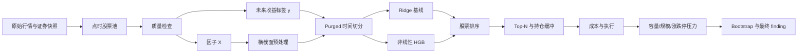
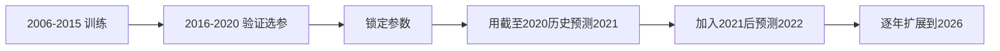

# 一只股票如何穿过整条量化流水线：从原始行情到可交易结论

> 这是一份配套 `ai-quant-research` 项目的学习文档。阅读顺序刻意安排为：先建立直觉，再看实际操作，最后看公式。本文用于研究与教育，不构成投资建议。

## 内容契约

- **目标读者**：懂基本 Python、知道股票涨跌，但还没有完整走过量化研究流程的 AI/算法工程师。
- **必要前置知识**：DataFrame、均值与标准差、训练集/验证集/测试集；不要求事先理解 IC、组合换手或市场冲击。
- **读完能完成的任务**：能够解释一条 A 股记录如何依次经过点时股票池、质量门禁、因子、可执行标签、预处理、时间切分、模型、组合和执行审计；能够判断一个回测是否存在常见泄漏；能够复算 RankIC、ICIR、换手率和净收益。
- **中心结论**：量化研究不是“下载数据—训练模型—看收益”三个步骤，而是一条信息时间、统计估计和交易执行必须相互一致的证据链。模型只是链条中间的一环。
- **适用范围**：本项目的周频 A 股横截面多因子选股。
- **不讨论范围**：高频订单簿、期权定价、做市、日内撮合、真实券商 API 和个性化投资建议。
- **一手贡献**：本文对应已经实际运行的 2006–2026 数据、约 1479 万行模型特征、Ridge/HGB walk-forward、组合和容量实验；数字来自本项目落盘结果，而非假想案例。

## 证据缺口先说明

当前研究有三项重要缺口：没有可靠的历史行业点时分类，因此尚未完成行业中性化；历史股票池是 BaoStock A 股点时代理，而不是官方中证历史成分；平方根冲击模型没有真实订单数据校准。后文所有结论都受这些边界约束。

---

## 0. 先看全流程地图

把一条量化研究想成一场有严格证据保管规则的接力赛：每一棒不仅要交出一个数，还要交代这个数在当时是否已经知道。



用一句话描述每一步：

1. **数据层**回答“历史上当时有什么数据”。
2. **因子层**回答“我们用什么信息描述一只股票”。
3. **标签层**回答“信号产生后，真实可获得的收益是什么”。
4. **评价层**回答“因子排序与未来收益排序是否稳定相关”。
5. **模型层**回答“如何组合多个因子形成一个预测分数”。
6. **组合层**回答“预测分数如何变成有限资金的持仓”。
7. **执行层**回答“这些目标持仓是否买得到、成本是多少”。
8. **统计层**回答“结果是稳定证据还是一段幸运历史”。

最终研究对象不是模型参数，而是下面这条映射：

$$
\text{当时可知信息}
\longrightarrow \text{预测分数}
\longrightarrow \text{可执行持仓}
\longrightarrow \text{成本后收益及其不确定性}.
$$

---

## 1. 第一步不是下载数据，而是定义研究问题

### 1.1 直观理解

如果只说“我要用 AI 预测股票”，几乎所有细节都是空的：预测哪只股票、预测多长时间、什么时候下单、和谁比较、允许买多少只、是否计算成本，都没有定义。

本项目把问题限定为：

> 每周最后一个交易日收盘后，用当时可得的 A 股信息给所有合格股票排序；下一交易日收盘执行；等权持有排名靠前的 200 只股票，并研究随后 5 个交易日的收益。

这一定义决定了后面所有表的时间字段和所有公式。

### 1.2 实际输入与输出

输入是一张某日横截面：一行一只股票，列是因子。输出不是“涨/跌”标签，而是一个可排序的连续分数。

| 对象 | 本项目定义 |
|---|---|
| 决策频率 | 周频，每周最后交易日 |
| 信号时点 | `t` 日收盘后 |
| 最早可执行时点 | `t+1` 收盘 |
| 预测目标 | 入场后 5 个交易日复合收益 |
| 股票池 | 历史 A 股点时可交易池 |
| 组合 | 多头 Top-200 等权 |

### 1.3 为什么必须先定义

如果信号在 `t` 日收盘后才计算，却把 `t+1` 从开盘到收盘的收益完整记给策略，就默认自己在产生信号前或瞬间成交。模型可能没有偷看标签，但回测执行已经偷看了时间。

---

## 2. 原始数据层：保存历史，而不是保存“今天看到的历史”

### 2.1 直观理解

今天打开行情软件，可以看到目前仍上市的股票及其历史 K 线。如果直接拿这些股票回测 2010 年，相当于提前知道了谁能活到今天，这叫幸存者偏差。

正确问题应该是：站在 2010 年某个星期五，当天研究员知道哪些股票存在、哪些停牌、哪些是 ST？

### 2.2 项目实际做法

- BaoStock：主行情源和历史证券快照；
- AKShare：独立抽样核对，不覆盖主数据；
- 原始表按证券分区写入 Parquet；
- 每次写入 manifest，记录来源、参数、行数、schema 和内容哈希；
- 原始表不做就地修改，修复结果写入新表。

主要代码：

- [`free_ingest.py`](../src/quant_research/free_ingest.py)
- [`ingest.py`](../src/quant_research/ingest.py)
- [`data_handbook.md`](data_handbook.md)

本项目当前数据覆盖 2006-01-04 至 2026-09-30，历史 A 股并集 5521 只，证券快照 1059 个。

### 2.3 三个关键日期

一条金融数据至少可能有三个日期：

- `event_date`：经济事件实际发生的日期；
- `publication_date`：外界能够知道它的日期；
- `available_date`：经过数据处理后，策略允许使用的日期。

价格收盘数据在 `t` 日收盘后才完整，因此本项目把由它构造的因子设为下一交易日可用：

$$
available\_date(t)=\operatorname{next\_trading\_day}(t).
$$

不能因为数据库的一行写着 `2020-12-31`，就默认在 2020-12-31 已经知道这行数据。财报尤其如此：报告期末不是公告日。

---

## 3. 点时股票池：防止“把未来赢家送回过去”

### 3.1 直观理解

股票池不是一张永远不变的名单，而是一部电影。新股上市、旧股退市、ST 和停牌都会改变每一天能研究和交易的对象。

### 3.2 实际操作

对每个周度快照，记录当时出现的股票。快照在下一交易日生效，并与当日交易状态、ST 状态和质量状态联合过滤。

一只股票在日期 $t$ 可进入研究截面，需要近似满足：

$$
Eligible_{i,t}
=Membership_{i,t}
\land Tradable_{i,t}
\land \neg ST_{i,t}
\land QualityPass_{i,t}.
$$

其中每一项都是布尔条件。任何一项为假，该股票就不能参与当日模型排序。

### 3.3 边界

当前 membership 是历史 A 股证券快照代理，不是官方 CSI 500 历史成分。因此可以研究“A 股点时横截面选股”，不能声称是在“严格历史中证 500 成分内选股”。

---

## 4. 数据质量：不是把异常值改漂亮

### 4.1 直观理解

质量处理有两类完全不同的问题：

1. **数据错误**：重复键、负成交量、OHLC 逻辑矛盾；
2. **真实但极端的市场现象**：涨停、暴跌、长期停牌后的跳空。

第一类应该修复或隔离；第二类不能因为看起来难看就删除。

### 4.2 质量门禁

本项目保留质量标志而不是直接覆盖原数值。典型检查包括：

- 主键 `(instrument_id, trade_date)` 是否重复；
- 日期是否单调、是否落在交易日历；
- $low\le \min(open,close)\le\max(open,close)\le high$；
- 成交量、成交额是否非负；
- 停牌时的价格和成交字段是否一致；
- 缺失率和异常率是否按年份突然跳变。

结果分为 `pass / warn / fail`。`fail` 禁止进入因子；`warn` 保留，让后续研究规则决定。

代码：[`quality.py`](../src/quant_research/quality.py)。

### 4.3 缺失值不是一种东西

同样是 `NaN`，可能表示：

- 股票刚上市，120 日动量窗口不足；
- 当天停牌，没有成交数据；
- 供应商接口没有该基本面字段；
- 数据下载失败。

这些情况的金融含义不同。项目用“截面中位数填补 + 缺失指示”保留这一区别，而不是盲目填零。

---

## 5. 标签：模型究竟在预测什么

### 5.1 最容易犯错的地方

假设今天是 $t$ 日：

- 收盘后才能完整计算今天的因子；
- 因子最早在 $t+1$ 可用；
- 本项目保守假设在 $t+1$ 收盘成交。

因此策略不能拥有 $t+1$ 当天已经发生的收益。真正可执行的第一段收益从 $t+1$ 收盘到 $t+2$ 收盘开始。

### 5.2 5 日可执行标签

设 $P_{i,t}$ 是股票 $i$ 在交易日 $t$ 的收盘价，简单日收益为：

$$
r_{i,t}=\frac{P_{i,t}}{P_{i,t-1}}-1.
$$

信号在 $t$ 日形成、在 $t+1$ 收盘入场，未来 5 日标签定义为：

$$
y_{i,t}
=\prod_{k=2}^{6}(1+r_{i,t+k})-1
=\frac{P_{i,t+6}}{P_{i,t+1}}-1.
$$

公式中的每一项：

- $i$：股票；
- $t$：因子截面日期；
- $t+1$：假设入场收盘；
- $t+2,\ldots,t+6$：真正归属于持仓的 5 个日收益。

代码：[`panel.py`](../src/quant_research/panel.py)。

### 5.3 极端值检查

- 如果所有未来日收益为 0，则 $y_{i,t}=0$；
- 如果任一必须的未来价格缺失，标签保持缺失，不能编造为 0；
- 标签只能用于训练和事后评价，不能参与当日因子填补或股票筛选。

---

## 6. 因子：把一只股票变成一组可比较的描述

### 6.1 直观理解

因子可以理解成股票的“体检指标”：最近涨得多不多、波动大不大、成交是否拥挤、估值高不高。单个指标不是买卖规则，而是一个候选解释变量。

本项目构造 15 个因子，分为：

- 动量与反转；
- 波动与极端收益；
- 流动性与换手；
- 量价关系；
- 估值。

定义见 [`factor_catalog.md`](factor_catalog.md)，实现见 [`factors.py`](../src/quant_research/factors.py)。

### 6.2 三个代表因子

#### 20 日动量

直觉：过去一段时间涨得多的股票，之后是否继续相对强势？

$$
Momentum^{20}_{i,t}=\frac{P_{i,t}}{P_{i,t-20}}-1.
$$

#### 5 日反转

直觉：最近被快速卖出的股票，是否出现短期价格修复？如果直接定义为最近收益的负数：

$$
Reversal^{5}_{i,t}
=-\left(\frac{P_{i,t}}{P_{i,t-5}}-1\right).
$$

过去 5 日跌得越多，反转因子越高。

#### Amihud 非流动性

直觉：同样 1 元成交额造成的价格波动越大，股票越难交易。

$$
ILLIQ^{20}_{i,t}
=\frac{1}{20}\sum_{j=0}^{19}
\frac{|r_{i,t-j}|}{Amount_{i,t-j}}.
$$

量纲大致是“每元成交额对应的绝对收益”。实务中可对它取对数或缩放，避免数值过小。

### 6.3 因子相关不等于重复结论

波动率、振幅和最大单日收益高度相关。对线性模型，它们可能造成系数不稳定；Ridge 可以通过正则化共享权重。对树模型，相关因子可能互相替代，因此不能把 split 次数直接当经济重要性。本项目使用周内成组置换检验因子重要性。

---

## 7. 预处理：让横截面可比，同时不偷看未来

### 7.1 为什么不能直接喂原值

Amihud 可能跨多个数量级，动量通常在小数范围，缺失率也不同。直接训练时，大数值和极端点会支配损失函数。

### 7.2 本项目的四步处理

对每个日期 $t$、每个因子 $j$ 单独处理：

1. median/MAD 稳健缩尾；
2. 截面中位数填补；
3. 添加缺失指示；
4. 当日横截面 z-score。

设当日因子原值为 $x_{i,t,j}$，中位数为：

$$
m_{t,j}=\operatorname{median}_{i}(x_{i,t,j}),
$$

MAD 为：

$$
MAD_{t,j}=\operatorname{median}_{i}|x_{i,t,j}-m_{t,j}|.
$$

用阈值 $c$ 缩尾：

$$
\tilde{x}_{i,t,j}
=\min\left(\max\left(x_{i,t,j},m_{t,j}-cMAD_{t,j}\right),
m_{t,j}+cMAD_{t,j}\right).
$$

填补后做标准化：

$$
z_{i,t,j}=\frac{\tilde{x}_{i,t,j}-\mu_{t,j}}{\sigma_{t,j}},
$$

其中 $\mu_{t,j}$ 和 $\sigma_{t,j}$ 只由日期 $t$ 当天的股票截面计算。

### 7.3 这和“分别用验证集均值方差”有什么区别

这里比较的是**同一天不同股票的相对位置**，统计量在决策时已经可见，所以每一天可以独立计算。

如果模型使用跨时间全局标准化：

$$
z_{i,t,j}=\frac{x_{i,t,j}-\mu_j^{train}}{\sigma_j^{train}},
$$

那么 $\mu_j^{train},\sigma_j^{train}$ 必须只由训练期拟合，再原样应用到验证和测试。不能分别用完整验证期或测试期重算，因为那会使用未来分布信息。

代码：[`preprocessing.py`](../src/quant_research/preprocessing.py)。

---

## 8. 时间切分与 purge：金融数据不能随机打乱

### 8.1 直观理解

普通机器学习把样本随机分成训练和测试，默认样本近似独立同分布。金融时间序列同时有时间漂移和标签重叠，随机切分会把未来市场状态送进训练集。

项目切分为：

- 训练：2006–2015；
- 验证：2016–2020；
- 历史样本外：2021–2026。该阶段结果已在研发过程中被检查，因此不能再称为从未查看的生产 lockbox。

### 8.2 为什么还要 purge

2015 年最后一个信号的 5 日标签可能延伸到 2016 年。如果直接把它放进训练，训练标签就包含验证期价格。

设标签持有期为 $H=5$ 个交易日，训练终点为 $T$。purge 后只保留满足下式的训练信号：

$$
t+H\le T.
$$

本项目还按测试年份做 expanding walk-forward：预测 2024 年时，可以使用 2006–2023 的历史，但不能使用 2024 年后半段重新训练年初模型。



---

## 9. IC、RankIC、IR 和 ICIR 到底在测什么

### 9.1 先用 4 只股票理解 RankIC

某天模型从高到低排序：

| 股票 | 因子分数排名 | 未来收益 | 收益排名 |
|---|---:|---:|---:|
| A | 4 | 3% | 4 |
| B | 3 | -1% | 1 |
| C | 2 | 2% | 3 |
| D | 1 | 1% | 2 |

RankIC 问的是：分数排名和未来收益排名有多一致。它不关心 A 的分数是 0.8 还是 80，只关心顺序。

### 9.2 IC 与 RankIC

普通 IC 是某日预测分数 $s_{i,t}$ 与未来收益 $y_{i,t}$ 的 Pearson 相关：

$$
IC_t=Corr_i(s_{i,t},y_{i,t}).
$$

RankIC 是二者排名后的相关，也就是 Spearman 相关：

$$
RankIC_t
=Corr_i\left(Rank(s_{i,t}),Rank(y_{i,t})\right).
$$

如果没有并列排名，还可以写为：

$$
RankIC_t
=1-\frac{6\sum_{i=1}^{N_t}d_{i,t}^2}{N_t(N_t^2-1)},
$$

其中 $d_{i,t}$ 是股票 $i$ 的两个排名之差，$N_t$ 是当天股票数。

对上面例子，排名差依次为 $0,2,-1,-1$，平方和为 6：

$$
RankIC=1-\frac{6\times6}{4(4^2-1)}=0.4.
$$

它表示方向上有正相关，但排序并不完美。

### 9.3 多期平均 IC 和 ICIR

有 $T$ 个周度 RankIC：

$$
\overline{IC}=\frac{1}{T}\sum_{t=1}^{T}IC_t,
$$

$$
s_{IC}=\sqrt{\frac{1}{T-1}\sum_{t=1}^{T}(IC_t-\overline{IC})^2}.
$$

周频年化 ICIR 定义为：

$$
ICIR_{annual}=\frac{\overline{IC}}{s_{IC}}\sqrt{52}.
$$

ICIR 衡量“预测相关性的均值相对于其时间波动有多大”。它不是策略收益率，也不是 Sharpe：

- 高 IC 不保证 Top-200 组合收益高；收益可能集中在尾部或中部；
- 高 ICIR 不包含交易成本和换手；
- IC 可能来自小盘或行业暴露；
- IC 序列有自相关时，简单年化会高估有效独立样本数。

因此 IC/ICIR 是模型诊断，不是最终可用性的单一判决。

### 9.4 收益 IR

策略相对基准的超额收益为：

$$
e_t=r_t^{strategy}-r_t^{benchmark}.
$$

周频年化信息比率：

$$
IR=\frac{\overline{e}}{s_e}\sqrt{52}.
$$

它和 ICIR 名字相似，但对象完全不同：ICIR 的输入是每期预测相关性；IR 的输入是每期组合超额收益。

---

## 10. 模型：从因子向量变成一个排序分数

### 10.1 Ridge 为什么是必要基线

对股票 $i$ 在日期 $t$ 的因子向量 $\mathbf{x}_{i,t}$，线性分数是：

$$
s_{i,t}=\beta_1x_{i,t,1}+\cdots+\beta_px_{i,t,p}
=\mathbf{x}_{i,t}^{\top}\boldsymbol{\beta}.
$$

Ridge 通过最小化：

$$
\hat{\boldsymbol{\beta}}
=\arg\min_{\boldsymbol{\beta}}
\left[\sum_{i,t}(y^{rank}_{i,t}-\mathbf{x}_{i,t}^{\top}\boldsymbol{\beta})^2
+\lambda\|\boldsymbol{\beta}\|_2^2\right].
$$

$\lambda$ 越大，系数越被压向 0。它适合处理波动率、振幅等高度相关因子，并提供一个难以被“AI”借口击败的稳定基线。

代码：[`model_baseline.py`](../src/quant_research/model_baseline.py)。

### 10.2 树模型究竟增加了什么

树模型允许类似下面的关系：

> 只有当 5 日反转很强、流动性没有差到极端、成交量又突然放大时，反转才更可能有效。

这不是固定线性系数能直接表达的，而是阈值和交互。项目使用 HistGradientBoosting，每棵新树拟合上一轮残差，形成：

$$
F_M(\mathbf{x})=F_0(\mathbf{x})+
\eta\sum_{m=1}^{M}h_m(\mathbf{x}),
$$

其中 $h_m$ 是第 $m$ 棵树，$\eta$ 是学习率。

为了避免后期股票数量更多的年份在损失函数中权重过大，每个训练周最多按“日期+股票代码”的确定性哈希抽取 300 只股票；抽样不使用收益标签。

代码：[`model_challenger.py`](../src/quant_research/model_challenger.py)。

### 10.3 为什么还要混合模型

树分数和 Ridge 分数先在当日转换成百分位秩，再组合：

$$
s^{blend}_{i,t}
=w\,RankPct(s^{tree}_{i,t})
+(1-w)RankPct(s^{ridge}_{i,t}).
$$

验证集选择 $w=0.75$。秩标准化避免两个模型分数尺度不同导致权重失真。

重要的是：验证期 AI 的 RankIC 明显更高，但历史样本外没有保持这个优势。这说明复杂模型可以拟合真实结构，也可能同时拟合某个历史阶段特有的结构。

---

## 11. 从分数到持仓：模型不等于策略

### 11.1 Top-N 组合

每周按分数从高到低选前 $N=200$ 只，等权：

$$
w^{target}_{i,t}=
\begin{cases}
1/N, & i\in TopN_t,\\
0, & \text{otherwise}.
\end{cases}
$$

在此之前剔除 Amihud 最差 10% 和换手率最低 10% 的股票。

### 11.2 为什么需要 200/400 缓冲

如果一只股票从第 199 名掉到 201 名，原始 Top-200 会完整卖出；另一只从 201 升到 199，又完整买入。两者预测差可能几乎为零，却产生真实成本。

缓冲规则：

- 新股票必须进入前 200 才能优先进入；
- 已持有股票只要仍在前 400 就允许保留；
- 空位再由最高分未持有股票补足。

这叫滞回或双阈值机制。样本外它把 Ridge 平均换手从约 0.631 降到 0.476，同时提升净收益，说明 Top-200 边界存在大量排序噪声。

代码：[`turnover_buffer.py`](../src/quant_research/turnover_buffer.py)。

### 11.3 漂移后换手

上一期目标权重不能直接和本期目标权重比较，因为股票已经涨跌。上一期权重先漂移：

$$
w^{drift}_{i,t}
=\frac{w^{target}_{i,t-1}(1+r_{i,t})}
{\sum_j w^{target}_{j,t-1}(1+r_{j,t})}.
$$

单边换手率：

$$
Turnover_t
=\frac{1}{2}\sum_i
|w^{target}_{i,t}-w^{drift}_{i,t}|.
$$

前面的 $1/2$ 防止一次“卖 A、买 B”被同时计为两份完整资产规模。

---

## 12. 成本、收益、回撤和 Sharpe

### 12.1 成本后收益

若 round-trip 成本假设为 $c$，则：

$$
Cost_t=c\cdot Turnover_t,
$$

$$
r_t^{net}=r_t^{gross}-Cost_t.
$$

本项目主报告使用 20bp，即 $c=0.002$，并报告 0/10/20/40bp 压力曲线。

### 12.2 年化收益

设共有 $T$ 个周收益，累计财富为：

$$
W_T=\prod_{t=1}^{T}(1+r_t^{net}).
$$

周频几何年化收益：

$$
R_{annual}=W_T^{52/T}-1.
$$

### 12.3 年化波动与零利率 Sharpe

$$
\sigma_{annual}=s_r\sqrt{52},
$$

$$
Sharpe_0=\frac{\overline{r}}{s_r}\sqrt{52}.
$$

这里下标 0 表示没有扣除无风险利率，因此不能与使用真实无风险利率的 Sharpe 混为一谈。

### 12.4 最大回撤

定义运行最高财富：

$$
Peak_t=\max_{u\le t}W_u.
$$

当期回撤：

$$
DD_t=\frac{W_t}{Peak_t}-1,
$$

最大回撤：

$$
MDD=\min_t DD_t.
$$

它是路径指标：即使两套策略年化收益相同，经历过的资金痛苦也可能完全不同。

---

## 13. 容量：一万元能做，不代表一亿元能做

### 13.1 静态 ADV 检查

ADV20 是过去 20 个交易日平均成交额：

$$
ADV_{i,t}^{20}=\frac{1}{20}\sum_{j=0}^{19}Amount_{i,t-j}.
$$

若限制交易额不超过 ADV 的比例 $p$，单只股票最多成交：

$$
TradeCap_{i,t}=p\cdot ADV_{i,t}^{20}.
$$

### 13.2 为什么要做动态执行

静态检查只看“本周订单能否成交”，但未成交订单会改变下周的真实持仓。动态模拟每周维护：

- 实际股票权重；
- 现金权重；
- 未能跟上的目标偏离；
- 当前净值对应的订单金额。

先卖出，再用可用现金买入；订单按 ADV 上限截断。未成交部分不会神奇消失。

### 13.3 平方根冲击模型

说明性冲击率：

$$
ImpactRate_{i,t}
=\eta\sigma_{i,t}
\sqrt{\frac{|Trade_{i,t}|}{ADV_{i,t}}}.
$$

冲击成本占组合资产比例：

$$
ImpactCost_t
=\sum_i\frac{|Trade_{i,t}|}{AUM_t}ImpactRate_{i,t}.
$$

本项目取 $\eta=0.5$ 作为情景参数，不是已校准常数。结果显示 1000 万元在 1% ADV 下基本能跟踪；5000 万元开始明显损耗；1 亿元以上不能再把模拟收益解释为原模型收益。

代码：[`capacity_execution.py`](../src/quant_research/capacity_execution.py)。

---

## 14. 规模、涨跌停和停牌压力测试

### 14.1 流通市值代理

BaoStock 当日换手率近似满足：

$$
TurnoverFraction_{i,t}
\approx\frac{Amount_{i,t}}{FloatCap_{i,t}}.
$$

因此构造：

$$
\widehat{FloatCap}_{i,t}
=\frac{Amount_{i,t}}{TurnoverPct_{i,t}/100}.
$$

这是估算代理，不是官方市值。按每个日期重新排名，分别剔除最小 10%/20%/30%，用来检查策略是否只是隐蔽的小盘策略。

### 14.2 t+1 交易约束

在真实 A 股中：

- 停牌时不能买卖；
- 涨停通常无法可靠买入；
- 跌停通常无法可靠卖出。

项目按 ST 5%、主板 10%、科创板 20%、创业板改革前后 10%/20% 的近似规则生成 `buy_allowed` 和 `sell_allowed`。受阻卖出继续保留旧持仓，受阻买入保留现金，不把权重重新分给“碰巧买得到”的股票。

代码：[`execution_constraints.py`](../src/quant_research/execution_constraints.py)。

---

## 15. Bootstrap：结果有多不确定

### 15.1 为什么不能把 291 周当成 291 个独立样本

相邻周共享市场状态，甚至可能共享部分持有期。普通独立 bootstrap 会打碎时间依赖，低估不确定性。

本项目使用 13 周循环块 bootstrap：随机抽取连续 13 周区块，拼接到原样本长度，重复 5000 次。

如果 $d_t$ 是 AI blend 与 Ridge 的周收益差，每次重采样得到：

$$
\widehat{\Delta}^{(b)}
=52\cdot\frac{1}{T}\sum_{t\in sample_b}d_t.
$$

再取 $\widehat{\Delta}^{(b)}$ 的 2.5% 与 97.5% 分位数作为经验区间。

### 15.2 本项目应如何解释

共同 291 周上，AI blend 相对 Ridge 的年化算术增量约 3.2%，但 95% 块 bootstrap 区间约为：

$$
[-0.9\%,\ 7.4\%].
$$

区间包含 0，所以可以说“有经济增量迹象”，不能说“统计上已经证明 AI 更强”。

同时，共同日期平均 RankIC 差约为：

$$
-0.0004,
$$

区间也跨 0。验证集上的树模型 IC 提升没有在历史样本外复现。

代码：[`robustness.py`](../src/quant_research/robustness.py)。

---

## 16. 把最终 finding 串起来

下面不是互相独立的漂亮数字，而是一条逐层收紧的证据链：

1. **因子有效**：Ridge 的样本外 RankIC 长期为正。
2. **模型有增量迹象**：AI blend 的组合年化高约 3.2 个百分点。
3. **但模型优势不稳固**：AI 的样本外平均 RankIC 没超过 Ridge，收益增量区间跨 0。
4. **收益不完全来自极端小盘**：剔除最小 20% 后仍保留大部分收益。
5. **收益不是纯粹无法成交**：流动性筛选和 t+1 涨跌停审计后仍存在。
6. **容量有限**：策略更像千万至数千万元规模，而不是数亿元容量产品。
7. **仍有暴露风险**：缺少历史行业中性化，不能把全部收益归因给选股模型。

这正是专业研究和 toy case 的区别：不是证明自己模型永远正确，而是不断尝试解释、削弱或推翻最初的好结果，看它最后还剩多少。

---

## 17. 最小复现路线

如果数据表已经存在，可以按下面顺序复现研究层：

```powershell
conda activate ai-quant
cd <path-to-repository>
pip install -e .

quant-model-baseline
quant-portfolio
quant-liquidity-stress
quant-turnover-buffer
quant-capacity analyze
quant-capacity-execution
quant-model-challenger
quant-challenger-portfolio
quant-model-interpretation
quant-size-stress analyze
quant-execution-constraints analyze
quant-robustness
quant-research-dashboard
quant-audit
python -m pytest -q
```

推荐阅读实际结果：

- [`research_report.md`](research_report.md)：正式研究结论；
- [`research_dashboard.html`](../reports/research_dashboard.html)：可视化面板；
- `data/lake/curated/`：每个阶段的 Parquet 结果；
- `config/`：所有研究假设和候选参数。

---

## 18. 常见误读与反例

### 误读一：RankIC 为正，所以一定赚钱

反例：模型可能在几千只股票整体排序不错，却在 Top-200 附近排序很差；或者换手成本完全吃掉收益。

### 误读二：测试集表现好，所以模型已经泛化

反例：如果研究员看过测试结果后反复修改模型，测试集已经变成新的验证集。本项目的落盘选择记录显示模型和组合参数来自 2016–2020 验证期；但研究框架本身在查看 2021–2026 结果后仍有迭代，所以这段数据只能作为历史样本外证据，不能冒充全新生产 lockbox。

### 误读三：横截面标准化使用测试日数据就是泄漏

反例：如果决策时可以看到当天所有候选股票的因子，那么当天横截面均值是当时可知信息，不是未来信息。真正泄漏的是用测试期未来日期共同估计一个跨时间 scaler。

### 误读四：AI 年化更高，所以 AI 显著更好

反例：本项目 AI 年化点估计更高，但配对区间包含 0，且平均 RankIC 没提升。点估计和统计证据不能混为一谈。

### 误读五：容量结果是固定真值

反例：改变 AUM、参与率、冲击系数、调仓频率或 Top-N，容量都会变化。没有真实订单校准时，它只是情景分析。

---

## 图件规格

1. **全流程图**：解释数据到结论的依赖关系；由本文 Mermaid 代码生成；alt 为“原始数据依次经过点时股票池、因子标签、模型、组合和稳健性审计”。
2. **时间切分图**：解释训练、验证、测试和逐年扩展；由本文 Mermaid 代码生成；alt 为“2006 至 2026 的 purged walk-forward 时间顺序”。
3. **证据图**：累计净值、回撤、成本、规模和容量图位于离线面板，由落盘 Parquet 结果重建，不使用装饰性图片。

## 引用与证据表

| 主张 | 一手证据 |
|---|---|
| 标签从 t+2 开始 | `src/quant_research/panel.py` 与 `config/research_panel.yaml` |
| 时间划分与 purge | `config/model_baseline.yaml`、`model_baseline.py` |
| Ridge/HGB 选择 | `model_selection`、`model_challenger_selection` Parquet 表 |
| 组合结果 | `robustness_cost_grid`、`turnover_buffer_oos_summary` |
| Bootstrap 区间 | `robustness_block_bootstrap` |
| 规模压力 | `size_stress_summary` |
| 动态容量 | `capacity_execution_summary` |
| 涨跌停执行 | `execution_constraint_summary` |
| 软件正确性 | 39 项 pytest 全部通过 |

本文没有引入需要额外网页核验的历史人物或优先权主张。供应商字段口径与项目转换记录在数据手册及 manifest 中。

## 发布元数据

- 标题：一只股票如何穿过整条量化流水线：从原始行情到可交易结论
- 摘要：用一个实际运行的 A 股 AI 多因子项目，先直观、后公式地解释点时数据、因子、RankIC、walk-forward、组合、成本、容量和统计审计。
- 初稿日期：2026-10-03
- 实质更新日期：2026-10-03
- 状态：研究文档；尚未作为公开网站文章发布
- Canonical：未设置
- 作者/方法说明：AI 辅助整理；研究代码、实验和结果位于当前项目
- 纠错入口：在项目中提交 issue，或直接修订本文并记录变更
- 风险披露：教育与研究用途，不构成投资建议；历史回测不代表未来表现

## 质量门自检

- [x] 单一目标读者、主要任务和中心结论明确。
- [x] 关键数字可追溯到项目结果表。
- [x] 变量首次出现时定义，关键公式可复算。
- [x] 对应代码已实际运行；完整测试为 40 passed，研究产物审计为 45 PASS / 2 WARN / 0 FAIL。
- [x] 包含反例、边界和替代解释。
- [x] 图件有教学目的、生成方式与 alt 说明。
- [x] Markdown 公式与代码块采用可滚动/可换行结构。
- [x] 有日期、方法说明、纠错入口与金融风险披露。
- [ ] 公开网站 canonical、分享卡、匿名访问与移动端实际预览尚未完成，因此不能标记为已发布。
